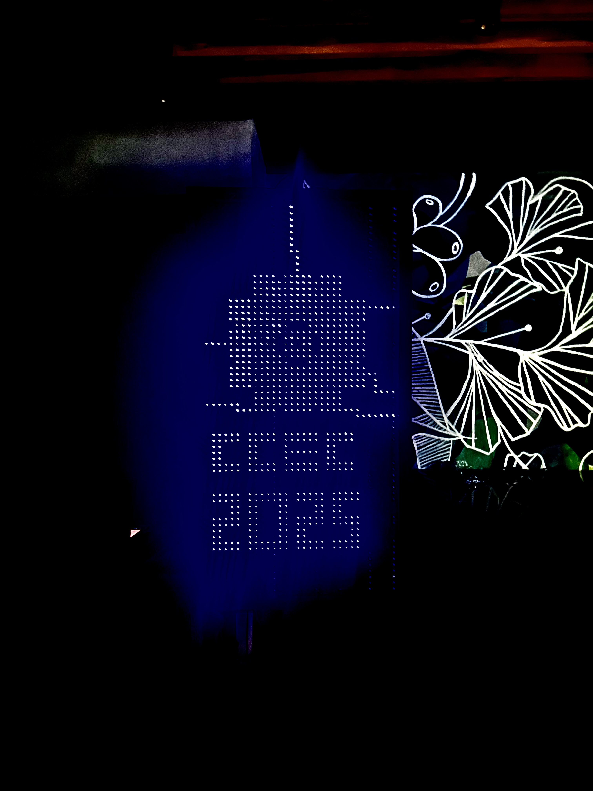

# MX-2048-matrix-grid
A 32*64 Led matrix made from scratch using 74hc595 shift registers and an esp 32 which enables to grid to be accessed with wifi via a server. 

The MX2048 is a custom-built LED matrix display system constructed using individually mounted LEDs and shift register-based control architecture. I worked in this project as the project manager back when I was the president of the engineeiring club of Curtin Colombo. The system enables real-time message display by receiving inputs from external devices over WiFi through a server hosted on a computer.

The project involved designing a scalable and efficient hardware architecture capable of handling large numbers of LEDs through multiplexing and serial data transfer techniques.

⚙️ Key Features:
Large-scale LED matrix built from discrete LEDs (no prebuilt modules)
Shift register-based control system for efficient data handling
Column-by-column scanning for dynamic display rendering
WiFi-based message input via a central server system
Multi-device connectivity allowing remote message updates
Upload and run videos in the internet

As part of the electrical engineering team, I was responsible for:

Designing the complete wiring architecture for the LED matrix
Implementing shift register connections for serial-to-parallel data transfer
Ensuring proper signal propagation and synchronization across the grid
Managing power distribution for stable operation of a large number of LEDs
Debugging hardware-level issues including timing inconsistencies and signal integrity

Technical Concepts Applied:

Shift registers (serial-to-parallel conversion)
Multiplexing and scanning techniques
Digital signal timing and synchronization
Large-scale circuit wiring and layout planning

🚀 Outcome:

Successfully developed a working LED matrix capable of displaying real-time messages
Achieved stable and responsive updates via WiFi-connected devices
Demonstrated efficient control of a high-density LED grid using minimal I/O resources

🔧 Design Challenges & Improvements:

Developed the system using breadboard-based prototyping due to limited access to custom PCB fabrication
Managed a large number of interconnections, requiring careful routing and debugging of signal paths
Encountered challenges related to signal integrity, wiring complexity, and physical layout constraints
Implemented iterative debugging to ensure stable operation despite hardware limitations

Breadboard setup:

Future Improvements:

Transition to PCB-based design for improved reliability and compactness
Optimize wiring layout to reduce noise and improve maintainability
Modularize the system for easier scalability

